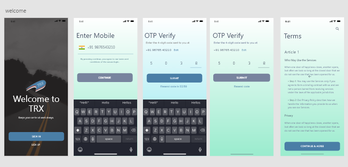
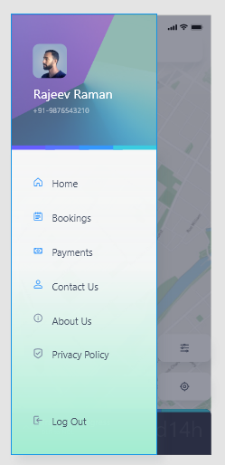
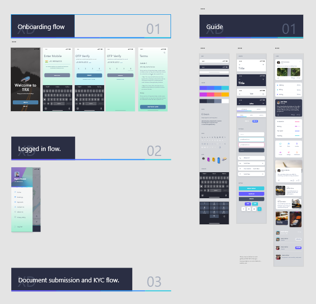

# pilot-app-ux
I started making an app using react-native, so thought of getting my hands dirty on UX design and interactive mockups for early agile feedback. 

### How to view this file:
https://creativecloud.adobe.com/apps/download/xd?promoid=B8NR3RT1&mv=other
once this is downloaded, get the XD file and import it using adobe XD.

https://www.loom.com/share/f41c54ee02614887a7d693d0c7f82fe6

ENJOY!!!

### Sample screens and design system:
version 1.0 for pilot react app for transport management

